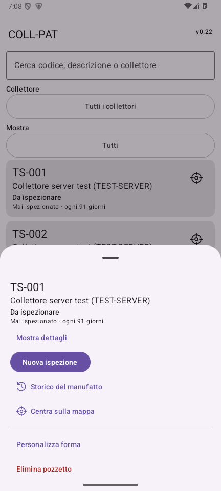
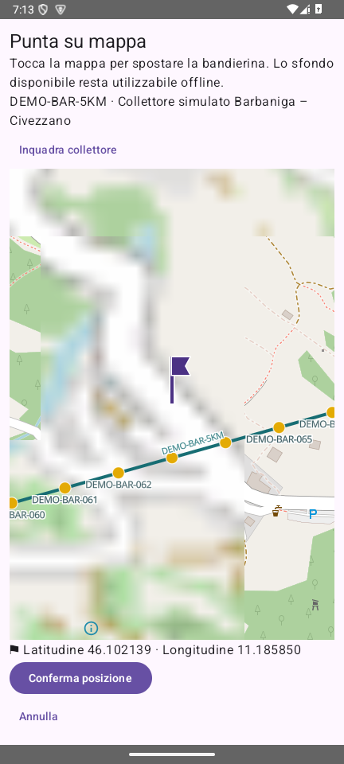

# Collaudo v0.22 — 24 settembre 2026

## Ambiente e metodo

Windows, JDK Android Studio, Gradle 8.13, SDK/target 36; emulatore Android API 35, telefono verticale 432×960 nello screenshot. PostgreSQL/PostGIS su localhost con database temporanei per i test SQL. Nessuna fixture caricata nel progetto operativo. APK con application ID `it.pat.collettori.pilot`, versionName 0.22, versionCode 22 e certificato precedente.

## Test automatici locali

- Suite Python completa: **125 superati**, incluso backend storico/PostGIS e sette nuovi test SQL v0.22. Dopo l'aggiunta del test paginazione utenti e backup/reset, suite SQL v0.22 ripetuta: **8 superati** (126 casi Python complessivi coperti fra i due run). Avviso di deprecazione anyio/Starlette, nessun errore.
- JVM Android: **116 superati**. Includono ereditarietà indipendente, override/ripristino, stato colori, connessioni stabili, invalidità, movimento schematico, geometrie importate conservate, dataset di posizionamento con sorgente bandierina indipendente, trimestre a maggio/settembre/gennaio/confine, anno bisestile, Europe/Rome, deduplica e filtri.
- SQL: ruoli PostgreSQL `authenticated`/`anon` effettivi e membership admin/inspector/viewer in database isolati. Letture viewer, rifiuto scritture anche su ricevute dopo revoca, storage, catalogo/utenti riservati, utenti estranei esclusi, richieste pending senza grant, 53 utenti su pagine 50+3, confronto del ruolo precedente/audit, ultimo admin con due richieste concorrenti. Export 206 righe su pagine 200+6, storico vuoto e revisione modificata fra pagine.
- Lint e APK debug/app-test compilati. Lint conserva warning di compatibilità/API e suggerimenti KTX; 45 warning, 2 hint e zero errori. Su Windows alcuni run JVM hanno incontrato un file di risultati bloccato: ripetuti con cartella risultati distinta, senza cambiare i test o sopprimere gli errori.

## Dispositivo di prova

**25 scenari strumentati superati**: 24 nel run esteso finale e il caso Barbaniga nel successivo run mirato. La prima asserzione visiva richiedeva il colore del tratto nell'inquadratura completa, dove i 126 simboli lo coprono: il test ora verifica prima pozzetti/bandierina sull'intero collettore, poi anche il tronco a zoom 16. Preparazione della bozza su v0.21 eseguita separatamente (un ulteriore test riuscito).

Il controllo screenshot ha individuato il renderer SurfaceView non correttamente composto nel dialogo. Le mappe di posizionamento/anteprima usano ora [TextureView tramite MapLibreMapOptions](https://maplibre.org/maplibre-native/android/api/-map-libre%20-native%20-android/org.maplibre.android.maps/-map-libre-map-options/texture-mode.html); la mappa principale conserva SurfaceView. Test a pixel per rete, simboli gialli e bandierina viola; immagini ispezionate manualmente. Lo sfondo nello screenshot può ancora caricare tessere a risoluzioni diverse, mentre rete e simboli restano locali.

Aggiornamento reale con `adb install -r` dalla APK distribuita v0.21 alla v0.22, senza disinstallazione. `V022UpgradeTest.prepareOnV021` è stato eseguito prima dell'aggiornamento: bozza con note, preferenze GPS/aspetto e allegato sintetico nel sandbox. Dopo l'aggiornamento `verifyOnV022` verifica stessa bozza, stato IN_ATTESA, catalogo, impostazioni e file. La prima asserzione di verifica attendeva erroneamente una riga outbox da un autosave: corretta per verificare il vero stato persistito della bozza; l'outbox del salvataggio esplicito è verificata separatamente.

`V022PersistenceTest`: transazione punto/tronco/outbox offline, retry senza duplicati, riapertura e spostamento; guardie repository con tre ruoli e simulazione; preferenze rapide FIFO e GPS persistito.

`V022UiTest`: quattro informazioni della card, dettagli chiusi/riapribili, comandi per ruolo, simulazione operatore senza bozza, banner/uscita, storico/ritorno e cambi rapidi durante HTTP lento senza errore coroutine; lista 126 elementi chiusa e lazy; portrait dopo rotazione richiesta; viewer/inspector con sessioni di prova distinte dalla simulazione; caricamento Barbaniga ripetuto, geometria 5 km, annullamento del picker e aggiunta di un punto con vero tronco.

Regressioni v0.15/v0.2: salvataggio bozza con outbox atomica e riapertura, catalogo offline seguito da invio/cancellazione senza riapparizione, batch oltre 9 MiB e dipendenze condivise, refresh timestamp solo dopo completamento, rifiuto catalogo per operatore.

Regressioni v0.21: salvataggio e riapertura bozza, assenza GPS motivata, modello sotto asfalto, eliminazione mirata di dati/allegati/code preservando oggetti estranei, retry fotografia, dipendenze point-patch/ispezione e invio durante upload bozza. UI v0.21: modulo/ispezione/ritorno/aspetto, coda e fallimento server, coordinate/mappa/annullamento/conferma.

## Verifica remota

[La migrazione 010 è applicata](MIGRATIONS-v0.22.md). Confrontati 60 corpi funzione locali/remoti, conteggi conservati, nuovi vincoli e RLS, nessun accesso client a auth.users o funzioni private. RPC utenti ed export senza JWT: HTTP 401; configurazione versione: HTTP 200.

## Limiti non collaudati

- Nessun login end-to-end remoto con tre account separati: il progetto remoto ha una sola membership admin. La simulazione non viene conteggiata come verifica server dei ruoli. Le sessioni UI sono controllate; i test di autorizzazione effettiva sono SQL locali.
- Nessun telefono fisico, tablet >=600dp, pieghevole o finestra ridimensionabile disponibile. [Android 16](https://developer.android.com/about/versions/16/behavior-changes-16) può ignorare orientamento/aspect ratio sui grandi schermi con target 36. Manifest portrait verificato su emulatore; nessuna promessa di blocco universale, nessun abbassamento target o hack. [Guida ufficiale](https://developer.android.com/develop/adaptive-apps/guides/app-orientation-aspect-ratio-resizability).
- Ritorno da fotocamera esterna e provider SAF di produttori diversi non verificati fisicamente. Persistenza file e retry foto sono coperti dai test strumentati; l'orientamento di app esterne resta gestito dal sistema.
- Gli export sono paginati e la scrittura CSV non costruisce un'unica stringa; le righe sono comunque conservate in memoria per deduplica. Un archivio oltre la memoria disponibile richiede anno/trimestre: il messaggio lo esplicita. Non misurata la capacità massima su dispositivi con poca RAM.
- Mappa con 126 pozzetti verificata nell'emulatore; nessuna misura comparativa di FPS su hardware fisico o rete reale di grandi dimensioni. Gli sfondi OSM offline dipendono dalla cache; le geometrie locali non dipendono dallo sfondo.
- Il dataset è sintetico e non è un rilievo topografico o fognario. Ripetizione del caricamento e aggiunta collegata testate in progetto locale isolato, non sul catalogo operativo remoto.

## Artefatto

SHA-256 APK: `3f50e1ba4745b38dc3d763b04746c0a1102b18499bc842d54e5f570b7f760e51`. Dimensione: 63,734,139 byte. Certificato SHA-256: `acf785391278fa98832980a51e594c88ffb06ff36b590c73c18c917f975080c6` (identico alla v0.21). Verificati application ID, versione/codice, configurazione pubblica nell'APK e assenza di chiavi private/asset sensibili. Nessun file APK, token o keystore committato.
